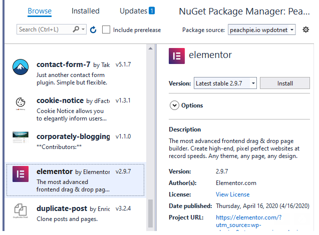

# Adding Plugin or Theme

## In your ASP.NET Core project

Plugins and themes in WpDotNet are provided as separate packages (either as .NET projects or as NuGet packages). 

### Add from NuGet gallery

There is a NuGet feed with existing packages at `"https://feed.peachpie.io/wpdotnet/v3/index.json"` which you register on your development machine using following command:

```shell
dotnet nuget add source https://feed.peachpie.io/wpdotnet/v3/index.json -n "peachpie.io wpdotnet"
```

Adding a package to the ASP.NET Core application with WpDotNet is a manner of adding a package reference. After adding the nuget source above, add the package reference using your IDE or the command `dotnet add package <slug_id> --version <version>-*`, where `<slug_id>` is unique identifier of the plugin or theme. Example of adding plugin with slug ID `"syntaxhighlighter"`:

```shell
dotnet add package syntaxhighlighter --version 3.5.4-*
```

Using **Visual Studio**, right click on your project and click command `Manage NuGet Packages`. Here, select the package source `"peachpie.io wpdotnet"` and browse for the package.



!!! caution "Note"
    Listed packages have dependency on specific version of `"Peachpied.WordPress"` package. As of now, before stable release of WpDotNet project, the PreRelease string of packages must match the PreRelease string of the depending package.

### Adding from sources

 Package is created from regular PHP WordPress plugin or theme. Refer to following instructions on how to create a .NET project and eventually a NuGet package from sources:

- [Build a plugin](../build-php-plugin/)
- [Build a theme](../build-php-theme/)

## Managing packages in WordPress Admin

Plugins and themes can be added into an already deployed ASP.NET Core application running WpDotNet. Navigate to the admin section at `/wp-admin/`, sub-sections 'Plugins' or 'Appereance'. Listed plugins and themes are actually compiled NuGet packages, ready to be installed and activated.

Installed packages have to be activated here as well.
