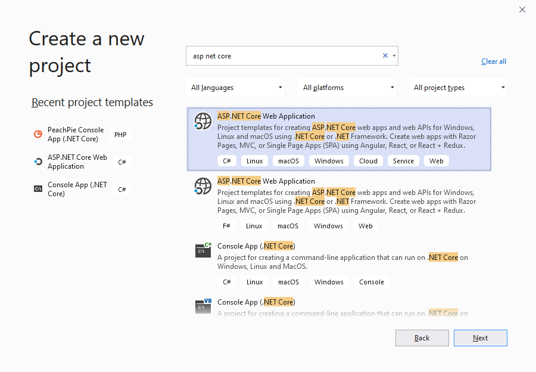
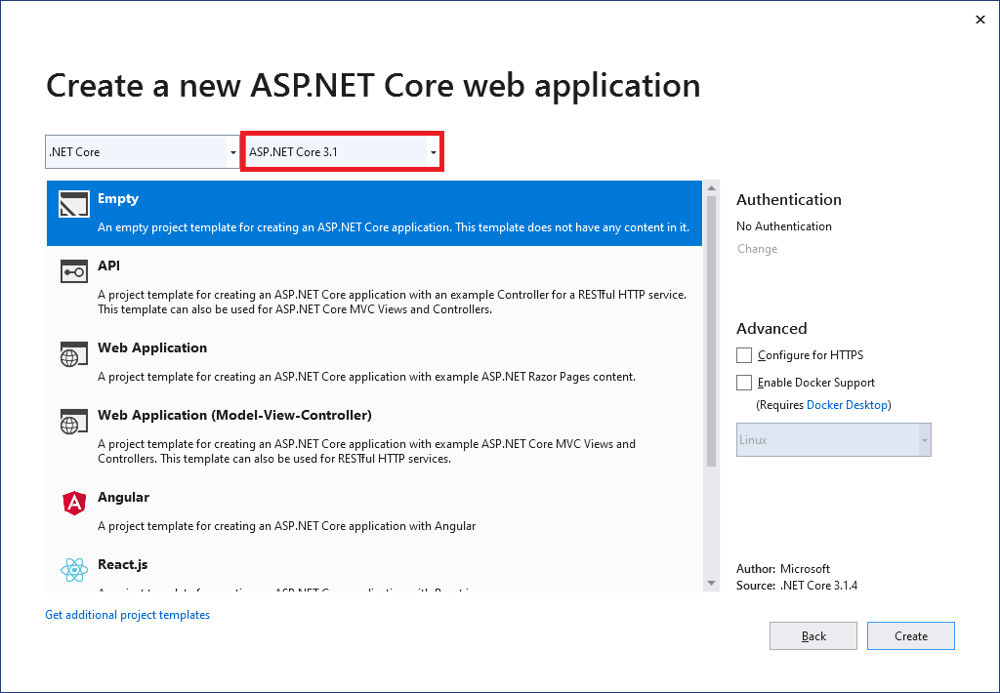
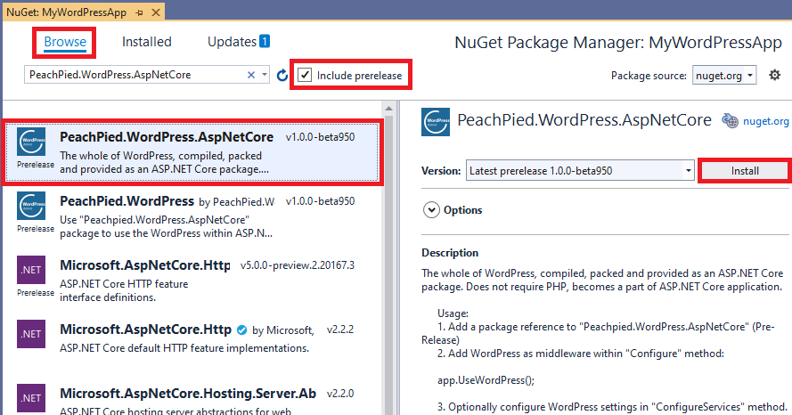
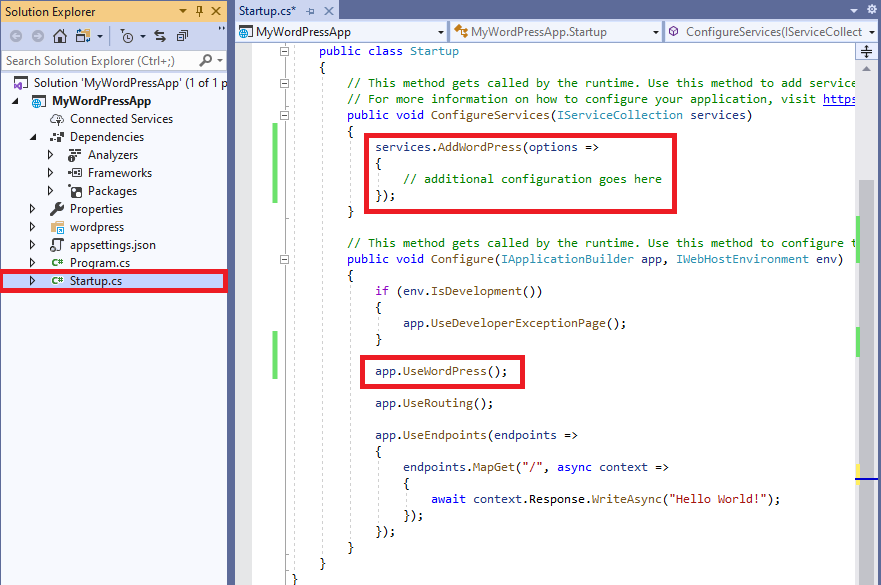
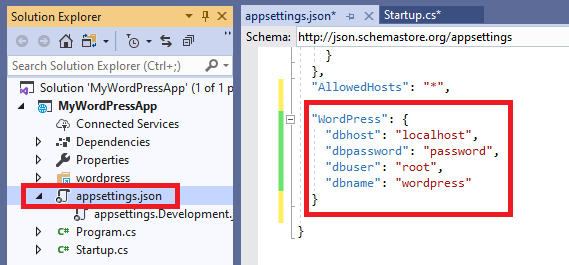
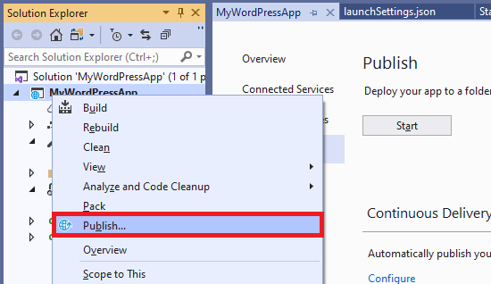

# ASP.NET Core with WordPress

*WpDotNet* is a package made primarily to be used as a part of an ASP.NET Core application. Its possible uses are:

- Running WordPress on ASP.NET Core, without PHP, or any source files on the server.
- Adding WordPress as a frontend to an existing ASP.NET Core application.
- Combining WordPress and MVC or Razor views.
- Extending WordPress with plugins in C#.

## Create and deploy an ASP.NET Core Web application with WordPress

The following tutorial is shown in Visual Studio 2019.

1. In Visual Studio, create a new *ASP.NET Core Web Application*. Select **File | New | Project** and search for the **ASP.NET Core Web Application** template for C#.

    

    Continue with **Next** and **Create**.

2. In the last step, make sure you are targeting **ASP.NET Core**, at least **3.0**. Other options can be customized. For an empty web site, choose the **Empty** project template, as it does not have any unnecessary logic.

    

    Continue with **Create**.

3. Add a package reference to **PeachPied.WordPress.AspNetCore**. Right click the project and select **Manage NuGet Packages...**. Switch to the **Browse** tab, tick **Include prerelease**, and search for **PeachPied.WordPress.AspNetCore**.

    

    Click **Install** and wait for the process to complete. Accept the license terms if prompted.

4. Next add WordPress to your request pipeline. Navigate to class **Startup** in file **Startup.cs**.

    

    Add `UseWordPress()` into your *IAplicationBuilder*, preferably right before *UseRouting()*.

    ```c#

        app.UseWordPress();

    ```

    The optional `services.AddWordPress( ... )` can be used to alter the WordPress configuration, such as the Site URL, database connection credentials and others, as described in [configuration](../configuration/).

5. Prepare the MySQL server. Make sure you have MySQL server running:

    - MySQL server is installed and running. It is up to you whether to install it locally, run it in a virtualized environment, such as Docker, or elsewhere.

    Example command to run MySql using docker:
    ```shell
    docker run -e MYSQL_ROOT_PASSWORD=password -e MYSQL_DATABASE=wordpress -p 3306:3306 -d mysql:latest
    ```

    - A database is created. It can be an empty database or a duplicate of an existing database with WordPress.
    - Ensure you have a valid username, password, and server address.

6. Enter the MySQL connection credentials in **appsettings.json**. Open the *appsettings.json* file and add the following section:

    

    ```json
    {
    "WordPress": {
        "dbhost": "localhost",
        "dbpassword": "password",
        "dbuser": "root",
        "dbname": "wordpress"
    }
    }

    ```

7. Run the application. Hit `F5` or press the **Start** button in Visual Studio.

8. Deploy the application using the *Publish* wizard. Right click the project, select **Publish**, and follow the instructions.

    

## Grab the sample solution

A complete ASP.NET Core application with WordPress is available on GitHub:

- https://github.com/iolevel/peachpie-wordpress

The content of the repository is ready to be built, debugged, and published. It can be opened in a .NET IDE (Visual Studio, VS Code, Rider) for further customization.

## Deploy Pre-Compiled to Azure

In case you don't need any customizations and you just want to publish WordPress running on .NET to your Azure, follow the link below:

- https://azuredeploy.net/?repository=https://github.com/iolevel/azure-wpdotnet

> Please note that the deployment link above requires the target Azure cluster to have the .NET Core 3.1 SDK installed.
