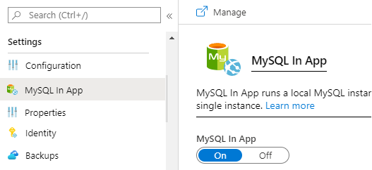

# Configuration

The WpDotNet application configuration is performed using 

- ASP.NET Core configuration providers and settings files, such as `appsettings.json`
- Registering options in the `ConfigureServices` startup method.

Read more about the [configuration on docs.microsoft.com](https://docs.microsoft.com/en-us/aspnet/core/fundamentals/configuration/).

## Default configuration

By default, an ASP.NET Core application reads configurations from settings files (using *JSON configuration provider*). The settings are read hierarchically in the following order:

1. *appsettings.json*.
2. *appsettings.`{Environment}`.json*. For example, `appsettings.Production.json` or `appsettings.Development.json`.

The `{Environment}` value is controlled using the process's environment variable `ASPNETCORE_ENVIRONMENT`. If not specified, the default value is `"Production"`. Read more at [environments on docs.microsoft.com](https://docs.microsoft.com/en-us/aspnet/core/fundamentals/environments).

**Sample appsettings.json**

```json
{
  "WordPress": {
    "dbhost": "localhost",
    "dbpassword": "password",
    "dbuser": "root",
    "dbname": "wordpress",
  }
}
```

The configuration is placed in the section `"WordPress": { ... }`. This allows to set the following options:

- *DbHost*: MySql database server address, including an optional port number. Default is `"localhost:3306"`.
- *DbUser*: database user name to connect with.
- *DbPassword*: database password.
- *DbName*: database name. It is expected that the database had already been created, using charset `utf8`.
- *DbTablePrefix*: optional prefix to database tables.
- *SiteUrl*: Optional URL where WordPress core files reside. It should include the http(s):// part, without the trailing slash `"/"` at the end.
- *HomeUrl*: Optional value which represents the public URL of the WordPress blog. It should include the http(s):// part, without the trailing slash `"/"` at the end. Adding this can reduce the number of database calls when loading the site.
- *Constants*: Object with name-values allowing to define additional runtime constants.
- *LegacyPluginAssemblies*: an array of assembly name values; each assembly represents a compiled PHP plugin, theme, or `wp-content` in general. This option will become deprecated as it won't be needed anymore, but for now it is needed to be specified.

> Note, since the setting files are hierarchical, the best practice is to set the common options in *appsettings.json*, and an environment-specific options in *appsettings.`{Environment}`.json*. This allows to maintain multiple environments, i.e. a different database connection for different host providers, staging, and development environments, at once.

## ConfigureServices

Register options in the `ConfigureServices` startup method to programically control the application settings.

**Sample ConfigureServices method**

```C#
public partial class Startup
{
    public void ConfigureServices(IServiceCollection services)
    {
        services.AddWordPress(options =>
        {
            options.DbHost = "localhost";
            options.DbName = "wordpress";
            // ...
        });
    }
}
```

## Response Cache

The application enables fast in-memory response caching by default. The cache bypasses all the GET and HEAD requests for non-logged-in users, and gets automatically cleaned when a post or a page is updated or added.

To disable the response caching, i.e. for development purposes, set the option `"EnableResponseCaching"` to `false`.

## Azure's MySQL In App

Azure web applications come with the free *MySQL in App* service, recommended for development purposes. This has to be enabled in your Web Application resource.



Once *MySQL In App* is enabled, WpDotNet hosted on the web application service will configure its database connection and database name accordingly.

The connection string is stored in the *MYSQLCONNSTR_localdb* environment variable set by Azure itself.

## HomeUrl

By default, WordPress stores the blog's URL in the database upon the first run during the setup process. Requests are automatically redirected to this URL if the application is accessed from a different address. There are usually several issues with this approach:

- During development, or when migrating a website, the URL changes but the stored value in the database does not. The application redirects requests to the old URL, which might not exist.
- Each request performs a query to the database to obtain the blog URL value, which causes an unnecesary overhead.

```json
{
    "WordPress": {
        "HomeUrl": "https://www.example.org"
    }
}
```

Setting the option `"HomeUrl"` is a recommended approach when the address is known, or when it has to be overriden. The value must start with the protocol specification, and must not be suffixed with the slash character.

As noted above, the application will redirect the user's requests to this address. Once the option is specified, the user won't be able to change its value in WordPress's dashboard settings.

## Multisite

> Multisite has not been documented yet.
