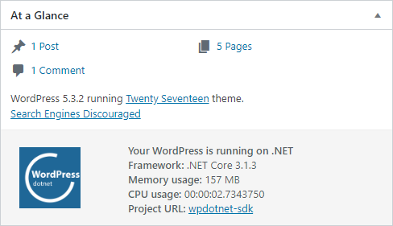

# Overview

[WpDotNet](https://wpdotnet.peachpie.io/) is the latest unmodified WordPress, running compiled purely on .NET, provided as a NuGet package & ready to be used as a part of an ASP NET Core application. WpDotNet comes with additional components and features, making it easy to be used from C# and a .NET development environment in general.

The project does not require PHP to be installed, and is purely built on top of the .NET platform.

## Requirements

- .NET Core SDK 3.0 or newer. ([dotnet.microsoft.com](https://dotnet.microsoft.com/download) or [visualstudio.microsoft.com](https://visualstudio.microsoft.com/vs/))
- MySQL Server ([dev.mysql.com](https://dev.mysql.com/downloads/mysql/) or [docker](https://hub.docker.com/_/mysql))

Make sure you have valid credentials to your MySQL server and you have created a database in it. The following quick start expects a database named `"wordpress"`. Database charset `"UTF-8"` is recommended.

## Quick Start

> A demo wordpress application is available at [github.com/iolevel/peachpie-wordpress](https://github.com/iolevel/peachpie-wordpress).

Open or create an ASP NET Core application, version 3.0 or newer.

Add a package reference to [`"Peachpied.WordPress.AspNetCore"`](https://www.nuget.org/packages/PeachPied.WordPress.AspNetCore/) (note it is a pre-release package):

```shell
dotnet add package PeachPied.WordPress.AspNetCore --version 5.7.0-preview6
```

Add WordPress middleware within your request pipeline, in the `Configure` startup method:

```C#
public partial class Startup
{
    public void Configure(IApplicationBuilder app)
    {
        // ...
        app.UseWordPress();
        // ...
    }
}
```

Add the WordPress option service within the `ConfigureServices` startup method and set up your database connection and other options:

```C#
public partial class Startup
{
    public void ConfigureServices(IServiceCollection services)
    {
        services.AddWordPress(options =>
        {
            options.DbHost = "localhost";
            options.DbName = "wordpress";
            // ...
        });
    }
}
```

> Note: the recommended approach is to place the configuration within the `appsettings.json` configuration file. See [configuration](../configuration) for more details.

## Dashboard

Besides regular WordPress dashboard pages, WpDotNet adds an informational panel on the Dashboard Home page, within the *At a Glance* widget.



The panel provides information about the current .NET runtime version, consumed memory, or total CPU time spent in the whole application. Note that the values are reset if the process is restarted.

## Remarks

- Permalinks are implicitly enabled through the URL rewriting feature.
- WordPress debugging is implicitly enabled when running in a *Development* environment.
- When running on Azure with MySql in App enabled, the database connection is automatically configured.
- Response caching and response compression is enabled by default.
- Most of the original `.php` files are not present on the file system and cannot be edited.

## Related links

- https://wpdotnet.peachpie.io/
- https://www.nuget.org/packages/PeachPied.WordPress.AspNetCore/   
[](https://www.nuget.org/packages/PeachPied.WordPress.AspNetCore/)
